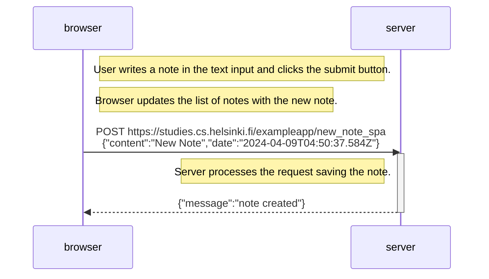

```mermaid
sequenceDiagram
participant browser
participant server

Note right of browser: User writes a note in the text input and clicks the submit button.
Note right of browser: Browser updates the list of notes with the new note.

browser->>server: POST https://studies.cs.helsinki.fi/exampleapp/new_note_spa <br/>{"content":"New Note","date":"2024-04-09T04:50:37.584Z"}
activate server

Note left of server: Server processes the request saving the note.

server-->>browser: {"message":"note created"}
deactivate server
```